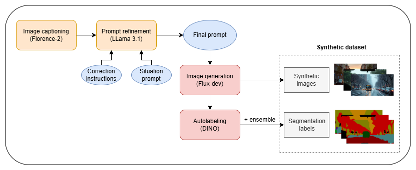

# Automated generative data augmentation for enhancing the robustness of segmentation neural networks

## Repository overview

This repo is a pipeline for creating synthetic data for semantic segmentation:

1. **Generate prompts** from images (`Create_Prompts`)
2. **Generate images** from prompts (`Create_Seg_Dataset`)
3. **Label images automatically** with an autolabeling model (`Create_Seg_Dataset`, `Train_Autolabel_Model`)
4. **Test if synthetic data helps** segmentation models (`Tester`)

---

## How to use
- Install dependencies (*requirements.txt*) in each folder.
- Train the autolabeling model:`Train_Autolabel_Model`

- To create the synthetic dataset:

  1. Create captions for images: `Create_Prompts/images2captions.py`
  2. Refine captions with the correction instruction and the situation prompt: `Create_Prompts/captions2prompts.py`
  3. Create synthetic images with FLUX.1-dev: `Create_Seg_Dataset/use_flux.py`
  4. Autolabel the synthetic images: `Create_Seg_Dataset/run_labeling.py`

- Test if the synthetic dataset improves the semantic segmentation models robustness: `Tester/train_deeplab`, `Tester/train_segformer`

!!!
**For details, see the README in each folder.**
!!!

---
 
## Shared models, datasets

#### Models

- Autolabeling models used in ensemble: https://huggingface.co/regpeter/DINO_autolabeling_models

#### Datasets:
- Generated prompts for FLUX.1-dev: https://huggingface.co/datasets/regpeter/flux_prompts

- Synthetic images - all realistic style: https://huggingface.co/datasets/regpeter/Flux_image_seg_3

- Synthetic images - realistic + drawing style: https://huggingface.co/datasets/regpeter/Flux_image_seg_drawing
